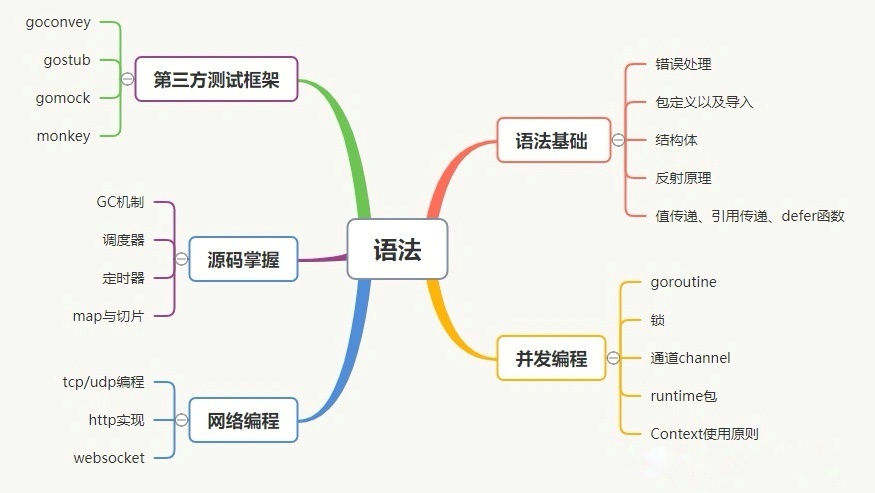
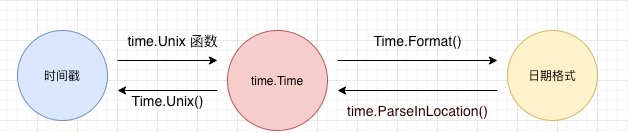

[TOC]

# golang 基础

## 学习路线



## go 环境相关

### GOPATH 和 GOROOT
不同于其他语言，go 中没有项目的说法，只有包, 其中有两个重要的路径，GOROOT 和 GOPATH

Go 开发相关的环境变量如下：

- GOROOT 就是 Go 的安装目录。

- GOPATH 是我们的工作空间,保存 go 项目代码和第三方依赖包。

### GO111MODULE 介绍

- GO111MODULE = off，go 命令行将不会支持 module 功能，寻找依赖包的方式将会沿用旧版本那种通过 vendor 目录或者 GOPATH 模式来查找。

- GO111MODULE = on，go 命令行会使用 modules，而一点也不会去 GOPATH 目录下查找。

- GO111MODULE = auto，默认值，go 命令行将会根据当前目录来决定是否启用 module 功能。这种情况下可以分为两种情形：
  - 1、当前目录在 GOPATH/src 之外且该目录包含 go.mod 文件。
  - 2、当前文件在包含 go.mod 文件的目录下面。

ps：修改修改 module 模式。`go env -w GO111MODULE=on`

### go.mod 下使用 vendor

选项 -mod=vendor

go run -mod=vendor mian.go 

ps：需要开启 mod(GO111MODULE = on) 才能用 -mod=vendor

### go 命令

- go mod tidy // 添加需要用到但 go.mod 中查不到的模块；删除未使用的模块

## Go 基础

### 反射

反射就是程序能够在运行时检查变量和值，求出它们的类型。

`reflect.Type` 表示 `interface{}` 的具体类型，而 `reflect.Value` 表示它的具体值。`reflect.TypeOf()` 和 `reflect.ValueOf()` 两个函数可以分别返回 `reflect.Type` 和 `reflect.Value`。

例子：

```go
package main

import (
    "fmt"
    "reflect"
)

type order struct {
    ordId      int
    customerId int
}

func createQuery(q interface{}) {
    t := reflect.TypeOf(q)
    v := reflect.ValueOf(q)
    fmt.Println("Type ", t) // Type  main.order
    fmt.Println("Value ", v) // Value  {456 56}
}

func main() {
    o := order{
        ordId:      456,
        customerId: 56,
    }
    createQuery(o)
}

```

- 其他补充
  1. `reflect.ValueOf(a).Interface()` // 取出 a reflect.Value 的值作为 interface{}
  2. `reflect.ValueOf(a).String()` // 取出 reflect.Value 的值作为 string
  3. `Value.Elem()` // 来获取由原始 reflect.Value 包装的值所指向的值（reflect.Value）。

- 注意

在 **go1.6 版本中反射机制会导出所有方法**（不论首字母是大写还是小写），而在**更高版本中反射机制仅会导出首字母大写的方法**。

### 网络编程

- 一些乱七八糟的代码

```go
package main

import (
    "bufio"
    "encoding/gob"
    "io"
    "net"
)

func main() {
    // listen
    // func Listen(network, address string) (Listener, error)
    l, _ := net.Listen("tcp", ":8888") 
    
    // accept
    // Accept() (Conn, error)。Conn 是一个 interface，它实现了 ReadWriterCloser 这个接口
    c, _ := l.Accept() 

    var buff bufio.Writer
    enc := gob.NewEncoder(&buff)
    type Data struct {
        a int
    }
    var data Data
    enc.Encode(data) // 把 data 序列化后的数据存到 buff 中

    var conn io.ReadWriteCloser
    dec := gob.NewDecoder(conn)
    var body interface{}
    dec.Decode(body) // 把 conn 中的数据反序列化到 body 中
}

```

#### http

- mux.HandleFunc

```go
mux := http.NewServeMux()
mux.HandleFunc("/api", apiFunc)
mux.HandleFunc("/", indexFunc)
server := http.Server {
    Addr: "127.0.0.1:3001",
    Handler: mux,
}
server.ListenAndServe()
```

- http.HandleFunc

```go
http.HandleFunc("/api", apiFunc)
http.HandleFunc("/", indexFunc)
http.ListenAndServe("127.0.0.1:3001", nil)
```

它们的区别是啥？通过查看 http 包的 HandleFunc 源码可以看出来。我们是用了 DefaultServerMux。第一种相当于自己管理 ServeMux 实例。第二种则是用 go 提供的默认实例。

```go
func HandleFunc(pattern string, handler func(ResponseWriter, *Request)) {
	DefaultServeMux.HandleFunc(pattern, handler)
}
```

参考链接：https://ask.csdn.net/questions/1011378

### Mutex

Mutex 用于提供一种加锁机制（Locking Mechanism），可确保在某时刻只有一个协程在临界区运行，以防止出现竞态条件。

Mutex 可以在 sync 包内找到。Mutex 定义了两个方法：Lock 和 Unlock。所有在 Lock 和 Unlock 之间的代码，都只能由一个 Go 协程执行，于是就可以避免竞态条件。

```go
mutex.Lock()
x = x + 1
mutex.Unlock()
```

在上面的代码中，x = x + 1 只能由一个 Go 协程执行，因此避免了竞态条件。

如果有一个 Go 协程已经持有了锁（Lock），当其他协程试图获得该锁时，这些协程会被阻塞，直到 Mutex 解除锁定为止。

### WaitGroup

WaitGroup 用于等待一批 Go 协程执行结束。程序控制会一直阻塞，直到这些协程全部执行完毕。

WaitGroup 使用计数器来工作。当我们调用 WaitGroup 的 Add 并传递一个 int 时，WaitGroup 的计数器会加上 Add 的传参。要减少计数器，可以调用 WaitGroup 的 Done() 方法。Wait() 方法会阻塞调用它的 Go 协程，直到计数器变为 0 后才会停止阻塞。

### 信道

```go
a := make(chan int) // 定义了一个 int 类型的信道 a。
data := <- a // 读取信道 a
a <- data // 写入信道 a
```

无缓冲的信道发送与接收默认是阻塞的。当把数据发送到信道时，程序控制会在发送数据的语句处发生阻塞，直到有其它 Go 协程从信道读取到数据，才会解除阻塞。与此类似，当读取信道的数据时，如果没有其它的协程把数据写入到这个信道，那么读取过程就会一直阻塞着。

```go
package main

import (  
    "fmt"
)

func hello(done chan bool) {  
    fmt.Println("Hello world goroutine")
    done <- true
}
func main() {  
    done := make(chan bool)
    go hello(done)
    <-done // 信道接收数据这里发生了阻塞，直到 hello 中往 done 写入数据，程序才往下执行
    fmt.Println("main function")
}
```


### 接口

- 如何确保某个类型实现了某个接口的所有方法呢？

一般可以使用下面的方法进行检测，如果实现不完整，编译期将会报错。

```go
var _ Person = (*Student)(nil)
var _ Person = (*Worker)(nil)
```

将空值 nil 转换为 *Student 类型，再转换为 Person 接口，如果转换失败，说明 Student 并没有实现 Person 接口的所有方法。

- 接口的嵌套

尽管 Go 语言没有提供继承机制，但可以通过嵌套其他的接口，创建一个新接口。

```go
package main

import (  
    "fmt"
)

type SalaryCalculator interface {  
    DisplaySalary()
}

type LeaveCalculator interface {  
    CalculateLeavesLeft() int
}

type EmployeeOperations interface {  
    SalaryCalculator
    LeaveCalculator
}

type Employee struct {  
    firstName string
    lastName string
    basicPay int
    pf int
    totalLeaves int
    leavesTaken int
}

func (e Employee) DisplaySalary() {  
    fmt.Printf("%s %s has salary $%d", e.firstName, e.lastName, (e.basicPay + e.pf))
}

func (e Employee) CalculateLeavesLeft() int {  
    return e.totalLeaves - e.leavesTaken
}

func main() {  
    e := Employee {
        firstName: "Naveen",
        lastName: "Ramanathan",
        basicPay: 5000,
        pf: 200,
        totalLeaves: 30,
        leavesTaken: 5,
    }
    var empOp EmployeeOperations = e
    empOp.DisplaySalary()
    fmt.Println("\nLeaves left =", empOp.CalculateLeavesLeft())
}
```

我们创建了一个新的接口 `EmployeeOperations`，它嵌套了两个接口：`SalaryCalculator` 和 `LeaveCalculator`。

如果一个类型定义了 `SalaryCalculator` 和 `LeaveCalculator` 接口里包含的方法，我们就称该类型实现了 `EmployeeOperations` 接口。

### 结构体

- 结构体嵌套接口

```go
package main

import (
	"fmt"
)

type phoner interface {
	run()
}

// xiaomi implement phoner
type xiaomi struct {
	version int
	price   int
}

func (x *xiaomi) run() {
	fmt.Printf("xiaomi version: %v, price: %v\n", x.version, x.price)
}

// huawei implement phoner
type huawei struct {
}

func (h *huawei) run() {
	fmt.Printf("huawei...\n")
}

type student struct {
	name string
	p    phoner // student 拥有手机的抽象，具体是什么手机看具体的实现
}

func (s *student) openPhone() {
	s.p.run()
}

func main() {
	x := &xiaomi{10, 10000}
	st := student{name: "zhangsan", p: x}
	st.openPhone()

	h := &huawei{}
	st2 := student{name: "lisi", p: h}
	st2.openPhone()
}

// 输出结果
// xiaomi version: 10, price: 10000
// huawei...
```

**注意**：struct 嵌套 interfece 相当于 struct 拥有这个 interface 的变量。interface 嵌套 interface 类似于继承。

### import

go 语言导包时 `.` 和 `_` 的区别是什么？

- `import _ "fmt"` 当导入一个包时，该包下的文件里所有 `init()` 函数都会被执行，然而，有些时候我们并不需要把整个包都导入进来，仅仅是是希望它执行 `init()` 函数而已。这个时候就可以使用 `import _` 引用该包。
- `import . "fmt"` 省略前缀的包名，也就是调用的 `fmt.Println("hello world")` 可以省略的写成 `Println("hello world")`。

### 格式化打印

- `%v` 按默认格式输出，如: `{gopher 123456 true}`
- `%+v` 在 `%v` 的基础上额外输出字段名，如: `{Name:gopher ID:123456 Enabled:true}`

- `%#v` 在 `%+v` 的基础上额外输出类型名

- `%t` 打印布尔值：true / false

- `fmt.Printf("%%\n")` // 不转义输出一个 %

### generate

go generate 命令是 go 1.4 版本里面新添加的一个命令，当运行 go generate 时，它将扫描与当前包相关的源代码文件，找出所有包含 "//go:generate" 的特殊注释，提取并执行该特殊注释后面的命令，命令为可执行程序，形同 shell 下面执行。

### time

- 转换关系图



- 实例代码

```go
// 日期格式转 Time
func timeStr2Time(fmtStr, valueStr, locStr string) time.Time {
	loc := time.Local
	if locStr != "" {
		loc, _ = time.LoadLocation(locStr) // 设置时区
	}
	if fmtStr == "" {
		fmtStr = "06-01-02T15:04:05"
	}
	t, _ := time.ParseInLocation(fmtStr, valueStr, loc)
	return t
}

// Time 转日期格式
func time2TimeStr(t time.Time) string {
	fmtStr := "2006-01-02 15:04:05" // format 格式必须是这个
	return t.Format(fmtStr)
}

// 时间戳转 Time
func timeStamp2Time(ts int64) time.Time {
	return time.Unix(ts, 0)
}

// Time 转时间戳
func time2TimeStamp(t time.Time) int64 {
	return t.Unix() // 返回时间戳的单位是秒
}

// 构造 Time
func constructTime() time.Time {
	// func Date(year int, month Month, day, hour, min, sec, nsec int, loc *Location) Time { ... }
	return time.Date(20, 1, 1, 1, 1, 1, 1, time.Now().Location())
}
```

- 参考链接

[Golang 时间操作大全](https://blog.csdn.net/asd1126163471/article/details/112504777?utm_medium=distribute.pc_relevant.none-task-blog-2~default~baidujs_baidulandingword~default-1.pc_relevant_paycolumn_v3&spm=1001.2101.3001.4242.2&utm_relevant_index=4)

### json

- 序列化（编码）

```go
// NewEncoder 创建一个将数据写入 w 的 Encoder。
func NewEncoder(w io.Writer) Encoder
// Encode 将 v 的 json 编码写入输出流，并会写入一个换行符
func (enc *Encoder) Encode(v interface{}) error
// Marshal 函数返回 v 的 json 编码。
func Marshal(v interface{}) ([]byte, error)
```

- 反序列化（解码）

```go
// NewDecoder 创建一个从 r 读取并解码 json 对象的 Decoder，解码器有自己的缓冲，并可能超前读取部分 json 数据
func NewDecoder(r io.Reader) Decoder
// Decode 从输入流读取下一个 json 编码值并保存在 v 指向的值里，参见 Unmarshal 函数的文档获取细节信息。
func (dec *Decoder) Decode(v interface{}) error
// Unmarshal 函数解析 json 编码的数据并将结果存入 v 指向的值。
func Unmarshal(data []byte, v interface{}) error
```

- 实例代码

```go
package main

import (
	"bytes"
	"encoding/json"
	"fmt"
)

type Student struct {
	Name string `json:"name"`
	Age  int    `json:"age"`
}

func main() {
	st := Student{Name: "panyu", Age: 18}

	var buf bytes.Buffer
	encoder := json.NewEncoder(&buf)
	encoder.Encode(st) // 序列化
	fmt.Println(buf.String())

	st1 := Student{}
	json.Unmarshal(buf.Bytes(), &st1) // 反序列化
	fmt.Printf("st1: %+v\n", st1)

	bts, _ := json.Marshal(st) // 序列化

	r := bytes.NewBuffer(bts)
	decoder := json.NewDecoder(r)
	st2 := Student{}
	decoder.Decode(&st2) // 反序列化
	fmt.Printf("st2: %+v\n", st2)
}

```

- **JSON 的 Encode/Decode，Marshal/Unmarshal 之间的关系和区别？**

In the `encoding/json` package, the `Marshal` function and the inverse `Unmarshal` function return and operate on single fixed bytes slices. They transform single objects to bytes, and vice versa.

There are also the `Encoder` and `Decoder` types. These contain the `Encode` and `Decode` methods, and they operate on streams of bytes, taking an `io.Reader` and `io.Writer` respectively. They also allow multiple objects to be serialized or deserialized with a newline delimiter using those streams.

The underlying mechanisms of `Marshal/Unmarsha`l functions and the `Encoder/Decoder` types are identical, they both use the same internal `encodeState.marshal` and `decodeState.unmarshal` codepaths. The only real difference is they provide alternative access for various usage patterns.

- 总结一下就是：`Encode/Decode`，`Marshal/Unmarshal` 方法底层调用的都是同一个方法进行序列化或者反序列化。

- 未知格式的 json

上面的代码是我们解析已知的固定格式的 json。但是有时候我们拿到的 json 是未知格式的。那么我们可以用第三方包  simplejson 去解析。参考链接：https://studygolang.com/articles/31227

### 读写文件

- read

```go
func readFile(fileName string) {
	fd, err := os.Open(fileName)
	if err != nil {
		log.Fatal(err)
	}
	defer fd.Close()
	b := bufio.NewReader(fd)
	for {
		line, err := b.ReadString('\n') // 遇到换行结束
		if err != nil {
			break
		}
		line = strings.Trim(line, "\n") // 注意这里会把换行读取进来，需要去掉
        fmt.Println(line)
	}
	return
}
```

- write

```go
func save2File(data []byte, filePath string) {
	f, err := os.OpenFile(filePath, os.O_TRUNC|os.O_WRONLY|os.O_CREATE, 0666)
	if err != nil {
		log.Fatal(err.Error())
	}
	_, err = f.Write(data)
	if err != nil {
		log.Fatal(err.Error())
	}
	f.Close()
}
```

### 闭包

- 闭包就是函数返回一个匿名函数

匿名函数是一个“内联“语句或表达式。匿名函数的优越性在于可以直接使用函数内的变量。

```go
func myfunc() func() int { // 返注意返回值，这里返回一个函数
    i := 0
    return func() int { // 匿名函数
        i += 1 // 可以使用匿名函数外的变量
        return i
    }
}
```

### 指针接收器和值接收器

- 如果方法接收器为对象的**指针**，则会修改原对象；如果方法接收器为对象的值，那么在方法中被操作的是原对象的副本，不会影响原对象。

```go
package main  
  
import "fmt"  

type Integer int 
 
// double 乘 2 
func (p *Integer) double() int {   
    *p = *p * 2   
    fmt.Printf("double p = %d\n", *p)  
    return 0   
}  

// square 平方  
func (p Integer) square() int {   
    p = p * p   
    fmt.Printf("square p = %d\n", p)  
    return 0   
}  
  
func main() {
    var i Integer = 2   
    i.double()				// receiver 为对象指针，原对象被修改
    fmt.Println("i = ", i)  
    
    i.square()				// receiver 为对象值，原对象不会被修改
    fmt.Println("i = ", i)  
}

```

- 当方法接收器为指针的时候，如果传入的是值，那么会报错。

```golang
package main

import "fmt"

type Animal interface {
	Speak() string
}

type Dog struct {
}

func (d Dog) Speak() string {
	return "Woof!"
}

type Cat struct {
}

func (c Cat) Speak() string {
	return "Meow!"
}

func main() {
	var a Animal = Dog{}
	fmt.Printf("a.Speak(): %v\n", a.Speak())

	var b Animal = Cat{}
	fmt.Printf("b.Speak(): %v\n", b.Speak())
}

// 输出结果
// a.Speak(): Woof!
// b.Speak(): Meow!
```

这里我们把值接收器修改为指针接收器，运行一遍

```golang
// func (c Cat) Speak() string
func (c *Cat) Speak() string
```

再运行一遍

```bash
# command-line-arguments
./main.go:27:6: cannot use Cat{} (type Cat) as type Animal in assignment:
        Cat does not implement Animal (Speak method has pointer receiver)
```

该错误的意思是：你尝试将 `Cat` 转为 `Animal` ，但是只有 `*Cat` 类型实现了该接口。你可以通过传入一个指针 （`new(Cat)` 或者 `&Cat{}`）来修复这个错误。

```go
var b Animal = &Cat{}
```

让我们做一些相反的事情：我们传入一个 `*Dog` 指针，但是不改变 `Dog` 的 `Speak()` 方法：

```go
var a Animal = &Dog{}
```

这种方式可以正常工作，因为一个指针类型可以通过其相关的值类型来访问值类型的方法（这句话可能有点绕。其实就是 ptr---> value，我们可以用 value 的类型访问 value 类型中的方法），但是反过来不行。即，一个 `*Dog` 类型的值可以使用定义在 `Dog` 类型上的 `Speak()` 方法，而 `Cat` 类型的值不能访问定义在 `*Cat` 类型上的方法。

这可能听起来很神秘，但当你记住以下内容时就清楚了：Go 中的所有东西都是按值传递的。每次调用函数时，传入的数据都会被复制。对于具有值接收者的方法，在调用该方法时将复制该值。例如下面的方法：

```go
func (t T) MyMethod(s string) {
    // ...
}
```

是 `func(T, string)` 类型的方法。方法接收器像其他参数一样通过值传递给函数。

因为所有的参数都是通过值传递的，这就可以解释为什么 `*Cat` 的方法不能被 `Cat` 类型的值调用了。任何一个  `Cat` 类型的值可能会有很多 `*Cat` 类型的指针指向它，如果我们尝试通过 `Cat` 类型的值来调用 `*Cat` 的方法，根本就不知道对应的是哪个指针。相反，如果 `Dog` 类型上有一个方法，通过 `*Dog` 来调用这个方法可以确切的找到该指针对应的 `Gog` 类型的值，从而调用上面的方法。运行时，Go 会自动帮我们做这些，所以我们不需要像 C语言中那样使用类似如下的语句 `d->Speak()` 。

小结一下：定义指针方法接收器只能用指针调用，值接受器既可以用指针，可以用值去调用。

**如何选择方法的 receiver 类型？**

- 要修改实例状态，用 *T。
- 无需修改状态的小对象或固定值，建议用 T。
- 大对象建议用 *T，以减少复制成本。
- 引用类型、字符串、函数等指针包装对象，直接用 T。
- 若包含 **Mutex 等同步字段**，用 *T，避免因复制造成锁操作失效。
- 其他无法确定的情况，都用 *T。

### 变量生命周期

- 全局变量：它的生命周期和整个程序的运行周期是一致的；
- 局部变量：它的生命周期则是动态的，从创建这个变量的声明语句开始，到这个变量不再被引用为止；
- 形式参数和函数返回值：它们都属于局部变量，在函数被调用的时候创建，函数调用结束后被销毁。

和 c/c++ 不同，Go 中分配的内存不需要我们进行手动释放，因为 Go 语言中的**逃逸分析**。

#### 逃逸分析

- 作用

逃逸分析的作用决定一个变量是分配在堆上还是分配在栈上。

在程序的编译阶段，编译器会根据实际情况自动选择在**栈**或者**堆**上分配局部变量的存储空间，不论使用 `var` 还是 `new` 关键字声明变量都不会影响编译器的选择。

- 好处

通过逃逸分析，可以尽量把那些不需要分配到堆上的变量直接分配到栈上，堆上的变量少了，会减轻分配堆内存的开销，同时也会减少 gc 的压力，提高程序的运行速度。

- 什么时候变量会逃逸

简单来说，编译器会根据变量是否被外部引用来决定是否逃逸：

1. 如果函数外部没有引用，则优先放到栈中；
2. 如果函数外部存在引用，则必定放到堆中；

针对第一条，可能放到堆上的情形：定义了一个很大的数组，需要申请的内存过大，超过了栈的存储能力。我们可以看下面这段代码。

```go
func add(a, b int) *int {
	d := a + b
	return &d
}
```

返回局部变量的地址，这里在 c/c++ 中会出大问题。但在 golang 中，编译器会帮助你把变量 d 给 moved to heap。当不再使用该变量的时候，golang 会垃圾回收掉这个变量。

- 示例

```go
package main

import "fmt"

var c int = 3

func add(a, b int) int {
	c := a + b
	return c
}

func add2(a, b int) *int {
	d := a + b
	return &d
}

func main() {
	var a int = 1
	var b int = 2
	add(a, c)
	add2(a, c)
	fmt.Println(b)
}
```

通过我们之前所说的内容，我们可以对该程序分析，哪些变量会逃逸到 heap 上。

很明显，`add2` 函数中的变量 `d` 是返回一个地址，所以该变量会逃逸。但还有没有其他变量逃逸了呢？答案是有，变量 `b` 也发生了逃逸。下面我们来执行一下代码，看下编译器输出。

```bash
go run -gcflags "-m -l" main.go
```

> 使用 go run 运行程序时，-gcflags 参数是编译参数。其中 -m 表示进行内存分配分析，-l 表示避免程序内联，也就是避免进行程序优化。

输出结果：

```bash
 $ go run -gcflags "-m -l" main.go
# command-line-arguments
./main.go:13:2: moved to heap: d
./main.go:22:13: ... argument does not escape
./main.go:22:13: b escapes to heap
```

可以看到，d 和 b 确实如上面所说的发生了逃逸。那为什么 b 也会发生逃逸呢？

这是因为有些**函数参数为 interface 类型**，比如 `fmt.Println(a ...interface{})`，编译期间很难确定其参数的具体类型，也会发生逃逸。

- 参考链接

[知乎：Golang之变量去哪儿？](https://zhuanlan.zhihu.com/p/58065429)

[Go语言变量逃逸分析](https://www.kancloud.cn/imdszxs/golang/1509511)

### context

用来解决 goroutine 之间`退出通知`、`元数据传递`的功能。在一组 goroutine 之间传递共享的值、取消信号、deadline 等。

### defer

语句 `defer` 向当前的函数注册稍后执行的函数调用。直到当前函数执行结束前才被执行。所以就算在函数内发送 panic 也会执行里面的 defer func。

> 注意：延迟调用可修改当前函数命名返回值

- 示例代码

```go
package main

import (
	"fmt"
)

func test() int {
	a := 100
	defer func() {
		a += 100
	}()

	return a
}

func test1() (z int) {
	z = 100
	defer func() {
		fmt.Printf("defer: %v\n", z)
		z += 100
	}()

	return
}

func test2() *int {
	z := 100
	defer func() {
		z += 100
	}()

	return &z
}

func main() {
	b := test()
	fmt.Printf("b: %v\n", b)

	c := test1()
	fmt.Printf("c: %v\n", c)

	d := test2()
	fmt.Printf("d: %v\n", *d)
}

// 输出结果
// b: 100
// defer: 100
// c: 200
// d: 200
```

- `return` 并不是 `ret` 汇编，它会先更新返回值，然后执行 `defer`，然后走到 `}` 才是 `ret` ，这个才是函数结束从栈弹出返回的标志。

- 匿名返回值，返回值是在 `return` 执行时声明的，`defer` 无法访问，等价于 `return` 了一个 `z` 的值拷贝，`defer` 修改 `z` 不影响返回值。命名返回值 `defer` 可以直接访问修改。
- 如果匿名返回值是指针，那就会影响返回值。

总结：最好是用命名返回值（golang 源码也是这样子写的），省去琢磨 defer 后返回的结果。特别是有些缓冲区需要 close 才算 terminating boundary。使用 defer close 很有可能返回值会 missing the terminating boundary。（今天写测试用例就遇到了这个问题，网上查了好久。以为是代码写错了，原来是 defer 的坑）

> 那些对性能要求高和压力大的算法，应该避免使用延迟调用。

### internal 目录

Go中命名为 internal 的 package **只有直接父级 package，以及父级 package 的子孙 package 可以访问**，其他的都不行，再往上的祖先 package 也不行。

For example, a package …/a/b/c/internal/d/e/f can be imported only by code in the directory tree rooted at …/a/b/c. It cannot be imported by code in …/a/b/g or in any other repository.

### 编译

#### 交叉编译

使用 GOOS、GOARCH 环境变量指定目标平台和架构。

```bash
// 交叉编译 linux 程序
GOOS=linux go build
// 编译 windows 程序
GOOS=windows GOARCH=386 go build
// 编译 macos 程序
GOOS=darwin GOARCH=amd64 go build
```

### panic，recover

```go
func panic(v interface{})
func recover() interface{}
```

panic 会立刻中断当前函数流程，执行延迟调用(defer)。在延迟调用函数中，recover 可捕获并返回 panic 提交的错误对象。

```go
func main() {
    defer func() {
        if err := recover(); err != nil { // 捕获错误
            log.Fatalln(err)
        }
    }()
    
    panic("i am dead") // 引发错误
    println("exit.")   // 永远不会执行
}
```

> 建议：除非是不可恢复性、导致系统无法正常工作的错误，否则不建议使用 panic。

### 指针

#### unsafe.Pointer

`unsafe.Pointer` 是特别定义的一种指针类型，它可以包含任意类型变量的地址（类似 C 语言中的 `void` 类型指针）。

- 任何类型的指针都可以被转化为 unsafe.Pointer；
- unsafe.Pointer 可以被转化为任何类型的指针；

## go 工具

### protoc-gen-go

- 安装命令

`go get -u github.com/golang/protobuf/protoc-gen-go` 

- 问题补充

`go get -u github.com/golang/protobuf/protoc-gen-go` 这个时候下载是在 GOPATH 下。需要把 protoc-gen-go mv 到 /usr/local/bin/。或者系统 PATH 设置有 GOPATH 路径那就不用移动。

- 参考链接

https://mp.weixin.qq.com/s/ntYd-b0f7YU7wOaWOHGGzQ

### msgp

msgp 是 MessagePack 的缩写，是一种高效的二进制序列化格式工具。基本 JSON 能做的事，msgp 都能做，而且比 JSON 更快，更小。

- 安装命令

`go get github.com/tinylib/msgp `

- 代码结构

```bash
.
├── go.mod
├── go.sum
├── main.go
└── protocol
    ├── protocol.go
    ├── protocol_gen.go
    └── protocol_gen_test.go
```

实例代码

`protocol.go`

```go
//go:generate msgp
package protocol

type Student struct {
	Name string
	Age  int
}
```

`main.go`

```go
package main

import (
	"bytes"
	"fmt"
	"test/protocol"

	"github.com/tinylib/msgp/msgp"
)

func main() {
	var bufEncode bytes.Buffer

	st := protocol.Student{Name: "xiaobai", Age: 18}
	msgp.Encode(&bufEncode, &st) // 把 st 序列化后往 bufEncode 写入数据

	st1 := protocol.Student{}
	msgp.Decode(&bufEncode, &st1) // 反序列化
	fmt.Printf("st1: %v\n", st1)
}
```

## go 杂项问题

### vscode go mod 报红

因为项目中有些包是引用到了 c++ 的代码，所以需要配置一下 c++ 相关的东西。

1. 在 ~/.zshrc 中加入（这里我用的是 zsh，bash 是另一个文件名字）

```bash
export CGO_LDFLAGS_ALLOW="pkg-config"
export CGO_CFLAGS_ALLOW="-Xpreprocessor"
```

2. 安装相关的库 brew install vips

3. vscode 添加 includePath

编辑 .vscode/c_cpp_properties.json

```bash
includePath": [
	"${workspaceFolder}/**",
 	"/usr/local/include/**" // 添加多这一行
],
```

4. 重启 vscode

## go 非标准库的数据结构

go 标准库中只有数组（slice）和 map 这两个常用的数据结构，要用到其他的数据结构就必须引用第三方的库。

### set

引入包 github.com/deckarep/golang-set

- example

```go
package main

import (
	"fmt"

	mapset "github.com/deckarep/golang-set"
)

func main() {
	se := mapset.NewSet()
	se.Add("tpy")
	se.Add("tpy")
	fmt.Printf("se.Cardinality(): %v\n", se.Cardinality())
	fmt.Printf("se.String(): %v\n", se.String())
}

// 输出
// se.Cardinality(): 1
// se.String(): Set{tpy}
```

