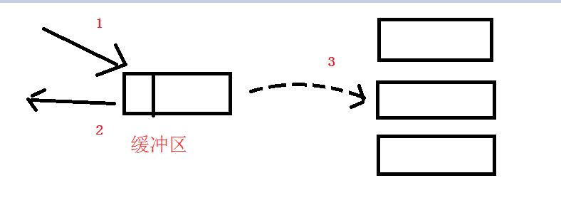

[TOC]

## mac os 安装

**安装**

- 安装的命令

`brew install kafka`

- 安装的目录

/usr/local/Cellar/kafka

**启动**

- 配置文件目录

/usr/local/etc/kafka

- 先启动 zookeeper

`zookeeper-server-start zookeeper.properties`

- 后启动 kafka

`kafka-server-start server.properties`

**遇到的问题**

- Failed to acquire lock on file

```bash
[2022-01-21 14:52:49,322] ERROR [KafkaServer id=0] Fatal error during KafkaServer startup. Prepare to shutdown (kafka.server.KafkaServer)
org.apache.kafka.common.KafkaException: Failed to acquire lock on file .lock in /usr/local/var/lib/kafka-logs. A Kafka instance in another process or thread is using this directory.
```

解决：直接删除 /usr/local/var/lib/kafka-logs 这个文件夹

- node already exists

```bash
EERROR Error while creating ephemeral at /brokers/ids/0, node already exists and owner '72057670489079818' does not match current session '72057670489079822' (kafka.zk.KafkaZkClient$CheckedEphemeral)
[2022-01-21 16:51:54,540] ERROR [KafkaServer id=0] Fatal error during KafkaServer startup. Prepare to shutdown (kafka.server.KafkaServer)
org.apache.zookeeper.KeeperException$NodeExistsException: KeeperErrorCode = NodeExists
```

解决：进入 zookeeper 客户端删除 /brokers/ids/0 节点

```bash
# 进入 zookeeper 的客户端
zkCl
ls /brokers/ids
# 删除 ids 0 节点
delete /brokers/ids/0
```

## 使用 docker 安装 kafka

- 拉取 docker 镜像

这里需要需要用到 zookeeper 和 kafka

```bash
docker pull wurstmeister/zookeeper
docker pull wurstmeister/kafka
```

**zookeeper 与 kafka 之间具体的是一种什么关系呢？**

> kafka 之间是无法互相发现对方的，每个 kafka 向 zk 注册，说我是 A 节点（broker.id），我是 B 节点，这样组成了一个 kafka 集群。每个人通过 zk 来发现彼此。

- 先启动 zookeeper

```
docker run -d --name zookeeper -p 2181:2181 -t wurstmeister/zookeeper
```

- 启动 kafka

```
docker run -d --name kafka \
-p 9092:9092 \
-e KAFKA_BROKER_ID=0 \
-e KAFKA_ZOOKEEPER_CONNECT=[ip]:2181 \
-e KAFKA_ADVERTISED_LISTENERS=PLAINTEXT://[ip]:9092 \
-e KAFKA_LISTENERS=PLAINTEXT://0.0.0.0:9092 wurstmeister/kafka
```

**注意：** [ip] 这里填写的是你本机的 ip 地址。如 172.17.0.1。如果个人电脑是 mac，在 [ip] 这块就不能填本机 ip（windows 和 linux 能够），须要填 docker.for.mac.host.internal

**启动 kafka 遇到的问题**

- kafka 连接 zookeeper 超时。随缘解决办法：1、rm zookeeper 容器，重新 run。2、重启电脑。这两种方法都试过，莫名其妙好了，真奇怪。

置此，我们已经启动了 zookeeper 和 kafka，下面我们来验证一下。

## 测试 kafka 生产与消费

参考链接：

- [kafka 中文文档](https://www.orchome.com/66)
- [macOS 下 使用 docker 安装 kafka](http://www.javashuo.com/article/p-eizveeqh-be.html)

## 使用 golang 连接 kafka

截止当前时间，github 上 golang 操作 kafka 的包主要有两个：

```
Shopify/sarama
confluentinc/confluent-kafka-go
```

## kafka 问题解答

### partition 和 key 的区别和关系

1、partition 在写入的时候可以指定需要写入的 partition，如果有指定，则写入对应的 partition。

2、如果没有指定 partition，但是设置了数据的 key，则会根据 key 的值 hash 出一个 partition。

3、如果既没指定 partition，又没有设置 key，则会采用轮询⽅式，即每次取一小段时间的数据写入某个 partition，下一小段的时间写入下一个 partition。

### 同步生产者和异步生产者

- kafka 同步生产者：这个生产者写一条消息的时候，它就立马发送到某个分区去。


- kafka 异步生产者：这个生产者写一条消息的时候，先是写到某个缓冲区，这个缓冲区里的数据还没写到 broker 集群里的某个分区的时候，它就返回到 client 去了。



### topic 和 partition 关系

topic 是逻辑队列，partition 是物理队列

假如我的一个 topic 有三个分区，那么生产者生产一条消息后会放到**其中的一个分区**（<u>注意这里不是一条消息存到三个分区中</u>）。


### partition 的有序性

为什么 kafka 是只能在 patition 上面做到有序，而 topic 如果有多个 partition 是不是就不能保证 topic 是有序的？

网上看到的一个例子：

某一天举办了一次吃鸡蛋大赛，可以以小组的形式参加，报名结束后，一共有两个小组参加：

- A 小组有三个人 A1，A2，A3
- B 小组有两个人 B1，B2

在他们面前各自放着三条流水线，鸡蛋从流水线滚下来（3 个分区），厨师（生产者）在后台不停的往流水线里加鸡蛋，防止参赛选手（消费者）不够吃。

A 小组正巧有三个人，就一人负责一条流水线，按照流水线的上鸡蛋的顺序吃。

B 小组只有两个人，其中 B1 饭量比较大，独自负责两条流水线，这条流水线吃一个，那条流水线吃一个。

这里就对应了一个参赛选择按鸡蛋的生产顺序进行吃鸡蛋，比如 A 小组，那么每个人吃的鸡蛋的顺序都是按照厨师放入流水线的顺序。而 B 小组的 B1 这个人，就一会儿这吃个一会儿吃那个，没有一个顺序性保证了。

比赛的结局就是谁最后吃的鸡蛋最多，谁就获胜。

## 其他补充

### 在 wsl 上安装 docker 和 kafka

因为家里用的 windows，所以平常用的都是 wsl 写代码。但是安装 docker 遇到了很多的问题。
好不容易安装好后，出现了 kafka 容器无法启动。

一度放弃 wsl 回去用了虚拟机。后面查询资料后发现 wsl 1 是不支持 docker 简答粗暴的安装的。需要切换到 wsl 2(可以简单的理解为 wsl 1 的升级版本)。查看 wsl 版本：wsl -l -v。

一键安装的 docker 的脚本代码如下（不是我写的）

```bash
# install docker
curl -fsSL get.docker.com -o get-docker.sh
sh get-docker.sh

if [ ! $(getent group docker) ];
then
    sudo groupadd docker;
else
    echo "docker user group already exists"
fi

sudo gpasswd -a $USER docker
sudo service docker restart

rm -rf get-docker.sh
```

安装好后启动 docker

```bash
sudo service docker start
# 查看 docker 的状态
sudo service docker status
# 重启
sudo service docker restart
```

避免每次使用 docker 都要加 sudo

```bash
sudo usermod -aG docker username
# username 为你的用户名
```

重启 wsl

```bash
wsl -d ubuntu -u root /etc/init.d/ssh start
```

## 参考链接
- [kafka 中文文档](https://www.orchome.com/66)
- [macOS 下 使用 docker 安装 kafka](http://www.javashuo.com/article/p-eizveeqh-be.html)